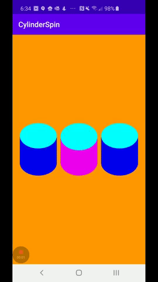

# SpinningCylinderView
I came across some art by Dave Whyte, particularly this [piece](https://www.instagram.com/p/B3dHAHCHSrv/?utm_source=ig_embed&utm_campaign=embed_video_watch_again), and was inspired to write some code! At some point I'd love to build the whole piece in code, but I started thinking about ways to render a 3D looking cylinder on a 2D canvas. The solution I came up with is to manipulates simple shapes based on the periodic changes of `sine` and `cosine` functions over time. 

I built this sample in Android using Kotlin. I created a custom view call CylinderView that will render a single spinning cylinder. You can add multiple instances of this view to a layout (as shown in the gif below), and even set the colors and spin direction of the cylinders using xml properties.

Note: Currently I have it so so that a cylinder that spins in the up direction will start at the PI/2 phase (quarter turn).
